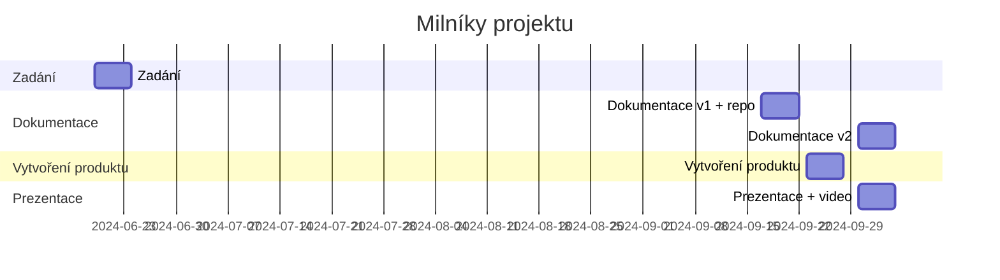

# Vlastní desky/shield
**Zadání: Rozmyslete, navrhněte, vytvořte, otestujte a vytvořte dokumentaci k vlastnímu shield**

Motivace - v 4r se budeme zabývat zejména datovými toky, tedy si připravíme shield ke zjednodušení načítání/indikaci dat.

## Termíny
| milník | termín | týdnů |
|:- | :- | -:|
| Zadání | **19.6.**  | 0 |
| Dokumentace v1 + repo | **17.9.-21.9.** | 13 |
| Vytvořený produkt | **23.9.-27.9.** | 14 |
| Termín prezentace + dokumentace v2 | **30.9.-4.10.** | 15 |

### Ganttův diagram postupu

## Minimální požadavky
* vytvoření shieldu pro ESP (Wemos D1 R1/R2)
* **vytvoření dokumentace - podle vzoru**
  * dodržení formálních požadavků na dokumentaci
  * popis vlastností shieldu
  * zapojení
    * Fritzing
    * schéma
  * ukázkový kód - modulární
* vhodný vlastní reprezentativní design

## Funkčnost shield
* indikátor stavu
  * varianty
    * RG / RB LEDs
    * RYG LEDs semafor
* min. 2 x RGB
  * varianty
    * ARGB pásek WS2812 nebo obdobný 
    * RGB LED
* LCD 1602 I2C display nebo obdobný
* DS18B20 čidlo kabel
  * 
* fotorezistor
volitelně:
* enkodér
  * pro nastavení PWM/procházení menu
  * 

Možnost postavit na předpřipraveném shield
* 
* 

## Dokumentace
* GIT repo
  * shield
      * průvodní dokument - vypracovaný ze vzoru
      * Fritzing
        * zdroj
        * obrázek
      * elektrotechnické schéma
      * fotky modulů
        * celkový
        * detaily
      * modulární zdrojový kód
        * pro každou součástku napsat, vyzkoušet, zdokumentovat kód
        * napsat tak, aby se jednotlivé moduly daly skládat dohromady (funkce/knihovny/třídy)
        * nastavit si správně piny
    * **odzdrojovat převzaté části**
  * fotky
    * minimálně 5 fotek zapojení jednotlivých částí
    * z toho alespoň jedna fotka kompletního produktu
  * video
    * vložené video/odkaz na video
    * délka min. 1 minutu (ne delší než 1:30)
      * ukázka funkčnosti
      * ukázka designu
      * ukázka procesu tvorby
      * z čeho je produkt sestaven
      * (efekty, hudba, humor - volitelně)
  * design

## Výstup
* produkt splňující minimální požadavky
* odevzdaná (tištěná) dokumentace
* GIT repo
* odkaz na vlastní GIT repo vložený do tabulky na společném repo
* prezentace funkčnosti před třídou
* video prezentující projekt o délce min. 1 minuty, ne delší než 1:30