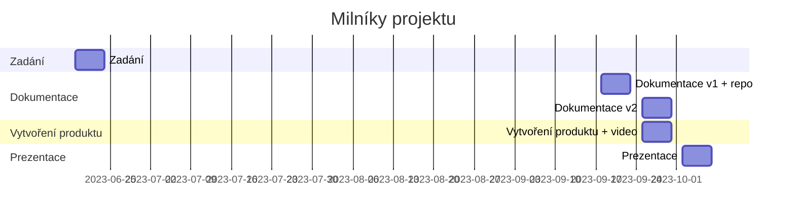
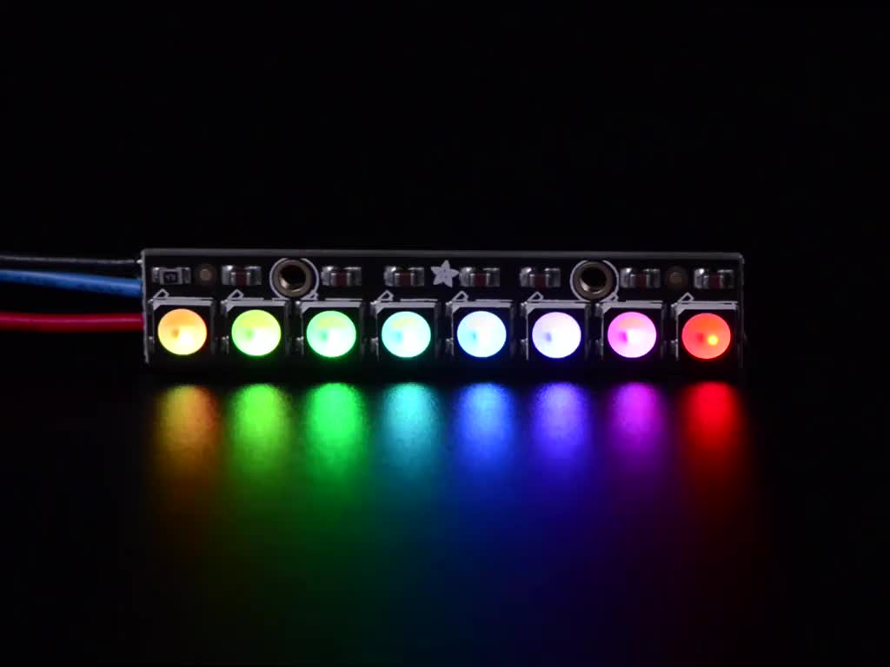
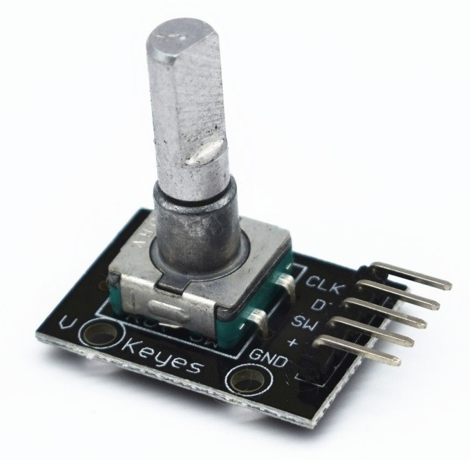
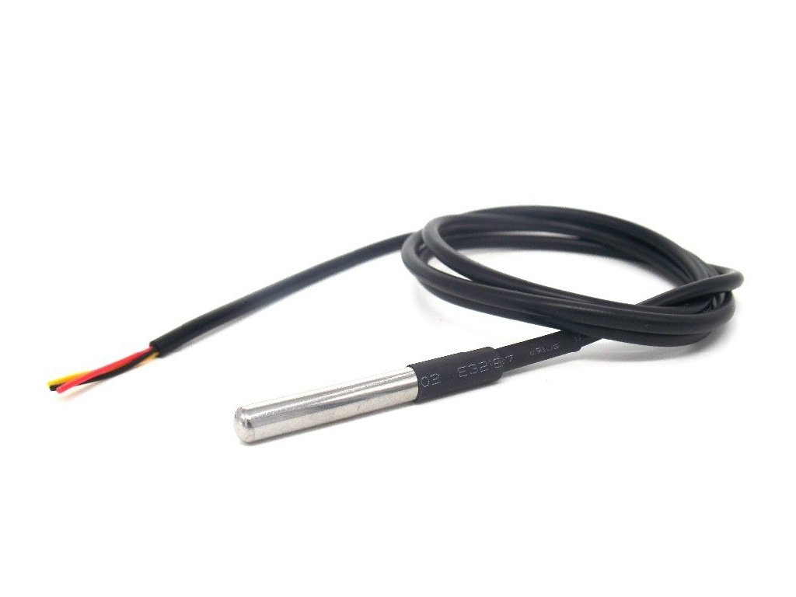
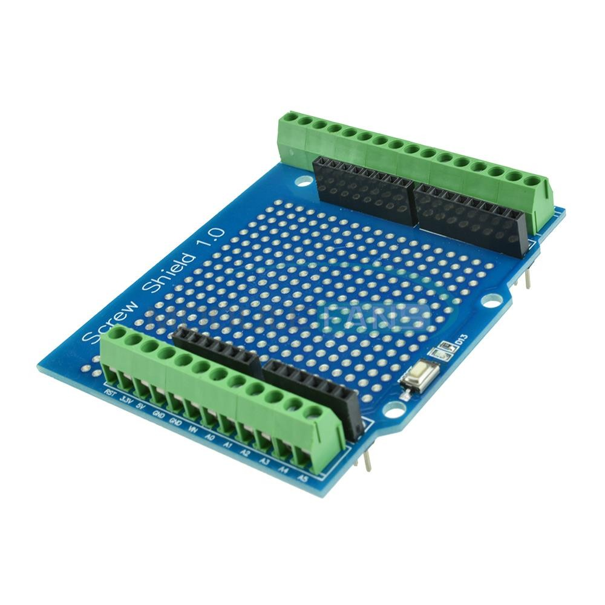
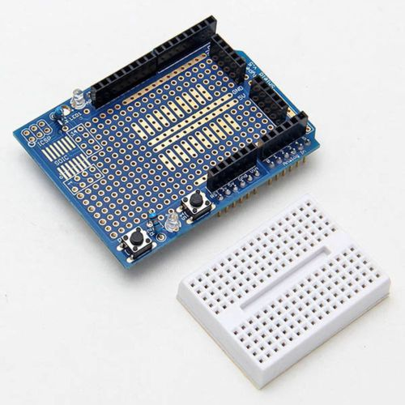

# Vlastní desky/shield
**Zadání: Rozmyslete, navrhněte, vytvořte, otestujte a vytvořte dokumentaci k vlastnímu shield**

Motivace - v 4r se budeme zabývat zejména datovými toky, tedy si připravíme shield ke zjednodušení načítání/indikaci dat.

## Termíny
| milník | termín | týdnů |
|:- | :- | -:|
| Zadání | **19.6.-23.6.**| 0 |
| repo + Dokumentace v1 | **18.9.-22.9.** | 13 |
| Vytvořený produkt + dokumentace v2 | **25.9.-29.9.** | 14 |
| Termín prezentace | **2.10.-6.10.** | 15 |

### Ganttův diagram postupu

## Minimální požadavky
* vytvoření shieldu pro ESP (Wemos D1 R1/R2)
* **vytvoření dokumentace - podle vzoru**
  * dodržení formálních požadavků na dokumentaci
  * popis vlastností shieldu
  * zapojení
    * Fritzing
    * schéma
  * ukázkový kód - modulární
* vhodný vlastní reprezentativní design

## Funkčnost shield
* indikátor stavu
  * varianty
    * RG / RB LEDs
    * RYG LEDs semafor
* min. 2 x RGB
  * varianty
    * ARGB pásek WS2812 nebo obdobný  
    * RGB LED součástky
* enkodér
  * pro nastavení PWM/procházení menu
  * 
* DS18B20 čidlo kabel
  * 
* fotorezistor

Možnost postavit na předpřipraveném shield

## Dokumentace
* GIT repo
  * desky
    * složky pro jednotlivé desky 1.-4.
      * průvodní dokument - vypracovaný ze vzoru
      * Fritzing
        * zdroj
        * obrázek
      * elektrotechnický nákres
      * fotky modulů
        * celkový
        * detaily
      * zdrojový kód
        * (knihovna)
    * **odzdrojovat převzaté části**
  * fotky
    * minimálně 5 fotek zapojení jednotlivých částí
    * z toho alespoň jedna fotka kompletního produktu
  * video
    * vložené video/odkaz na video
    * délka min. 1 minutu (ne delší než 1:30)
      * ukázka funkčnosti
      * ukázka designu
      * ukázka procesu tvorby
      * z čeho je produkt sestaven
      * (efekty, hudba, humor - volitelně)
  * design

## Výstup
* produkt splňující minimální požadavky
* odevzdaná tištěná dokumentace
* GIT repo
* odkaz na vlastní GIT repo vložený do tabulky na společném repo
* prezentace funkčnosti před třídou
* video prezentující projekt o délce min. 1 minuty, ne delší než 1:30