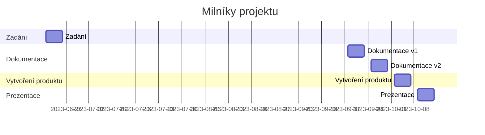

# Vlastní desky/shield
## Zadání: Rozmyslete, navrhněte, vytvořte, otestujte a vytvořte dokumentaci k vlastním deskám

Možné situace:
* vlastní desky s integrovanými čidly/akčními členy
* shield pro ESP (Wemos D1 R1/R2, ...)

## Termíny
| milník | termín | týdnů |
|:- | :- | -:|
| Zadání | **19.6.-23.6.**| 0 |
| Dokumentace + repo v1 | **18.9.-22.9.** |  |
| Vytvořený produkt + dokumentace v2 | **25.9.-29.9.** |  |
| Termín prezentace | **2.10.-6.10.** |  |

### Ganttův diagram postupu

## Minimální požadavky
* vytvoření 4 desek, nebo shieldu pro ESP
* vytvoření dokumentace
  * popis vlastností
  * zapojení
    * Fritzing
    * schéma
  * ukázkový kód
* vhodný vlastní reprezentativní design

## Funkčnost desek
* deska 1
  * 1x analogový vstup
  * 1x analogový výstup
  * 1x digitální vstup
  * 1x digitální výstup
* deska 2
* deska 3
* deska 4

## Dokumentace
* GIT repo
  * desky
    * složky pro jednotlivé desky 1.-4.
      * průvodní dokument - vypracovaný ze vzoru
      * Fritzing
        * zdroj
        * obrázek
      * elektrotechnický nákres
      * fotky modulů
        * celkový
        * detaily
      * zdrojový kód
        * (knihovna)
    * **odzdrojovat převzaté části**
  * fotky
    * minimálně 2 fotky každého produktu
    * z toho alespoň jedna fotka kompletního produktu
  * video
    * vložené video/odkaz na video
    * délka min. 1 minutu (ne delší než 1:30)
      * ukázka funkčnosti
      * ukázka designu
      * ukázka procesu tvorby
      * z čeho je produkt sestaven
      * (efekty, hudba, humor - volitelně)
  * design

## Výstup
* produkt splňující minimální požadavky
* odevzdaná tištěná dokumentace
* GIT repo
* odkaz na vlastní GIT repo vložený do tabulky na společném repo
* prezentace funkčnosti před třídou
* video prezentující projekt o délce min. 1 minuty, ne delší než 1:30